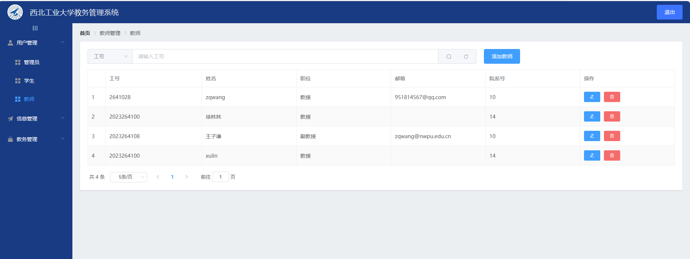

# myProjects
个人项目汇总
1.西工大教务系统
前端：Vue3+ElementUI
后端：SpringBoot
数据库：Mysql
共分为学生端、教师端、管理员端三部分。
管理员端：
    
    
    
    
    
    
    
    
    
教师端：
    
    
    
    
    
学生端：
    
    
    

登录界面：
    